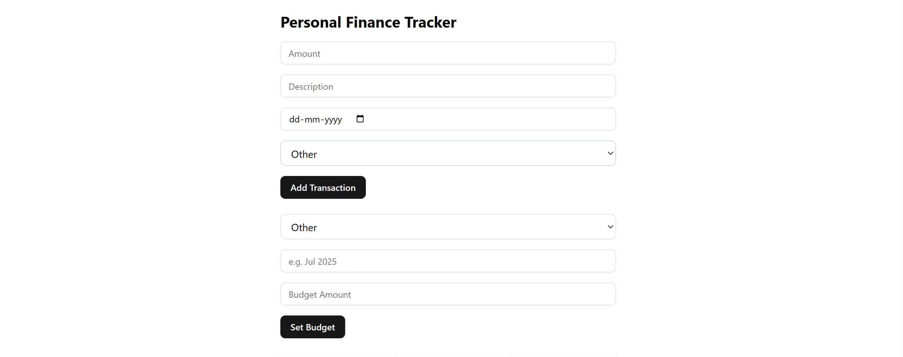
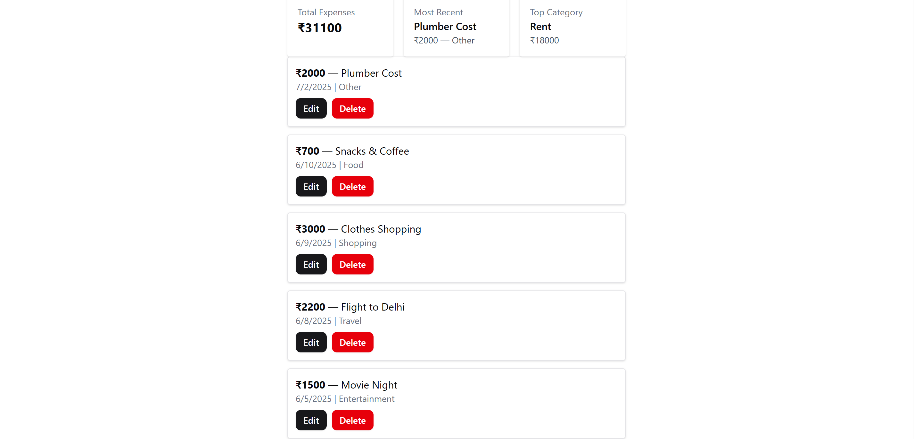
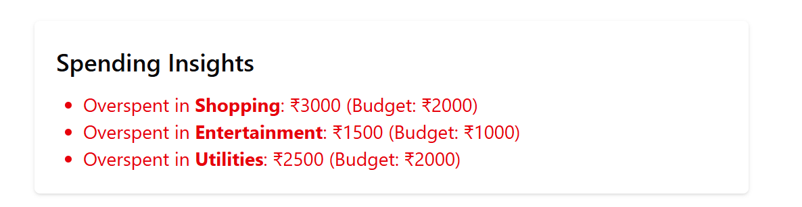
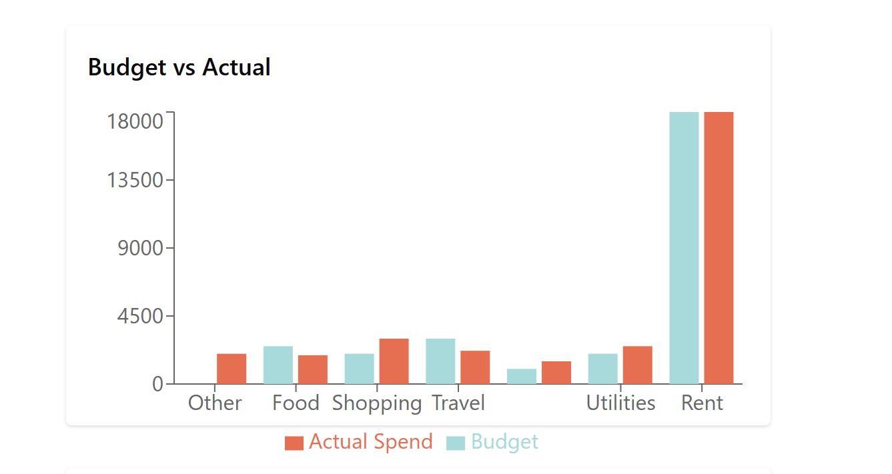
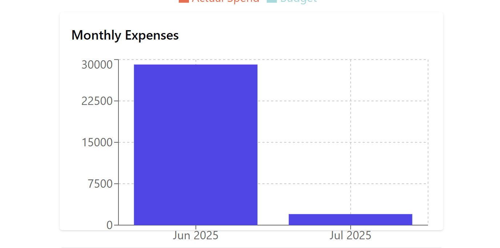
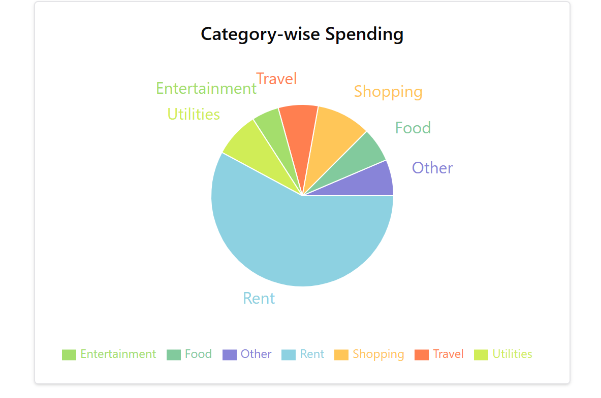

# 📊 Personal Finance Visualizer

A simple, beautiful, and responsive web application to **track personal finances**, visualize monthly spending, and manage budgets — built using **Next.js**, **React**, **MongoDB**, **Recharts**, and **shadcn/ui**.

> ⚠️ This app includes **sample data** pre-filled for demonstration purposes — you can immediately explore all features.

---

### 🚀 Live Demo

🔗 [Deployed Live on Vercel](https://your-deployment-url.vercel.app)  
📂 [GitHub Repository](https://github.com/atharva5924/Personal-Finance-Visualizer)

---

### 📌 Features Overview (Stage-wise)

---

#### 🧾 Stage 1: Basic Transaction Tracking

- ✅ Add, Edit, and Delete transactions (amount, description, date)
- ✅ View all transactions in a list
- ✅ Monthly **expenses bar chart**
- ✅ Clean responsive form with **input validation**

---

#### 🗂️ Stage 2: Categories Dashboard

- ✅ Select from **predefined categories** while adding transactions
- ✅ **Category-wise pie chart** to visualize spending patterns
- ✅ **Dashboard summary** cards:
  - Total Expenses
  - Category Breakdown
  - Most Recent Transactions

---

#### 💰 Stage 3: Budgeting & Insights

- ✅ Add **monthly budgets** for each category
- ✅ Compare **budget vs actual spending** with a visual chart
- ✅ Get **spending insights** like overspending alerts or remaining budgets

---

### 🎯 What Can Users Do?

- ➕ Add a transaction with category, description, date, and amount
- 📝 Edit or delete any existing transaction
- 📅 Track expenses month-wise and category-wise
- 📊 Visualize data through interactive bar and pie charts
- 💸 Set a budget for a category in a specific month
- 📉 Instantly see how you're spending vs your budget
- 🔍 Get insights on overspending or remaining budget

---

### 🧪 Sample Data

#### Transactions:

| Date       | Amount | Description      | Category      |
| ---------- | ------ | ---------------- | ------------- |
| 2025-07-01 | ₹1200  | Groceries        | Food          |
| 2025-07-02 | ₹18000 | Monthly Rent     | Rent          |
| 2025-07-03 | ₹2500  | Electricity Bill | Utilities     |
| 2025-07-05 | ₹1500  | Movie Night      | Entertainment |
| 2025-07-08 | ₹2200  | Flight to Delhi  | Travel        |
| 2025-07-09 | ₹3000  | Clothes Shopping | Shopping      |
| 2025-07-10 | ₹700   | Snacks & Coffee  | Food          |

#### Budgets:

| Month    | Category      | Budget Amount |
| -------- | ------------- | ------------- |
| Jul 2025 | Food          | ₹2500         |
| Jul 2025 | Rent          | ₹18000        |
| Jul 2025 | Utilities     | ₹2000         |
| Jul 2025 | Entertainment | ₹1000         |
| Jul 2025 | Travel        | ₹3000         |
| Jul 2025 | Shopping      | ₹2000         |

---

### 🖥️ Tech Stack

| Layer            | Tech                                                 |
| ---------------- | ---------------------------------------------------- |
| Framework        | [Next.js](https://nextjs.org)                        |
| Frontend Library | React, Tailwind CSS                                  |
| UI Components    | [shadcn/ui](https://ui.shadcn.com)                   |
| Charts           | [Recharts](https://recharts.org)                     |
| Backend API      | App Router API Routes                                |
| Database         | [MongoDB Atlas](https://www.mongodb.com/cloud/atlas) |
| Deployment       | Vercel                                               |

---

### 📷 UI Preview

## 📸 UI Screenshots

### ✍️ Add Transaction & Budget Form

Users can add new transactions and define category-wise monthly budgets.



---

### 📊 Dashboard Summary

Overview of total expenses, category-wise breakdown, and recent transactions.



---

### 💡 Spending Insights

Highlights if you’ve overspent in any category based on your defined budget.



---

### 📈 Budget vs Actual Chart

Visual comparison between budgeted amounts and actual spending per category.



---

### 📅 Monthly Expenses Bar Chart

Shows expenses grouped by month to understand long-term spending patterns.



---

### 🥧 Category-wise Pie Chart

Breakdown of spending distribution across different categories.



---

### ✅ Notes

- All screenshots are captured with real sample data inserted for demonstration.
- UI is fully responsive and clean, ensuring a great experience across devices.

---

## 📁 Project Structure

```bash
personal-finance-visualizer/
│
├── app/
│   ├── api/
│   │   ├── transactions/
│   │   │   └── route.js
│   │   └── budgets/
│   │       └── route.js
│   ├── page.js
│   └── layout.js
│
├── components/
│   ├── ui/
│   │   ├── button.jsx
│   │   └── input.jsx
│   ├── TransactionForm.js
│   ├── TransactionList.js
│   ├── BudgetForm.js
│   ├── DashboardSummary.js
│   ├── SpendingInsights.js
│   ├── MonthlyBarChart.js
│   ├── CategoryPieChart.js
│   └── BudgetVsActualChart.js
│
├── lib/
│   └── mongodb.js
│
├── models/
│   ├── Transaction.js
│   └── Budget.js
│
├── public/
│   └── favicon.ico
│
├── screenshots/
│   ├── input-form.png
│   ├── dashboard-summary.png
│   ├── spending-insights.png
│   ├── budget-actual-chart.png
│   ├── monthly-bar-chart.png
│   └── pie-chart.png
│
├── styles/
│   └── globals.css
│
├── .env.local
├── package.json
├── tailwind.config.js
├── postcss.config.js
├── README.md
└── next.config.js

```

---

### 🛠️ Installation & Running Locally

```bash
# 1. Clone the repository
git clone https://github.com/atharva5924/Personal-Finance-Visualizer.git
cd personal-finance-visualizer

# 2. Install dependencies
npm install

# 3. Create a .env file and add MongoDB URI
touch .env.local
# Example .env.local
MONGODB_URI=mongodb+srv://<username>:<password>@cluster.mongodb.net/personal-finance?retryWrites=true&w=majority

# 4. Run the dev server
npm run dev

# App will be running at:
http://localhost:3000

---

### ✅ Submission Notes

- 🚫 **No authentication** is implemented, as per requirement.
- 🧪 The app includes **pre-seeded data** to test features without needing to manually add anything.
- 🎯 Built with **clean, modular code** and fully responsive UI.

---

### 👨‍💻 Developer

**Atharva Nile**
CSE Undergrad @ IIIT Nagpur
📧 atharvanile2005@gmail.com
🔗 [LinkedIn](https://www.linkedin.com/in/atharva-nile-a50120294) • [GitHub](https://github.com/atharva5924)

```
---

Let me know once you've added screenshots or deployed it — I can update this file with image previews and final Vercel link if you like!


---

